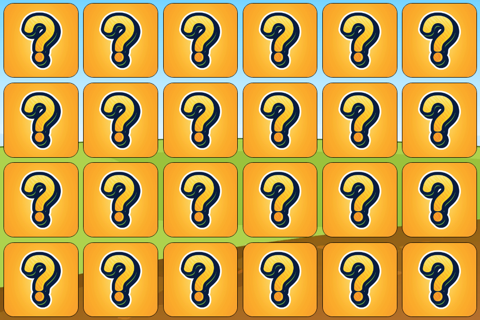

# Picture Match
Picture Match is an engaging memory and puzzle game designed to provide entertainment and cognitive exercise to players of all ages. Our project aims to offer an enjoyable and visually stimulating gaming experience that challenges memory and pattern recognition skills. Picture Match is intended for individuals who seek a fun way to test their memory and sharpen their cognitive abilities.

This fully responsive web-based game will immerse players in a delightful challenge, requiring them to match pairs of images hidden on the game board. Whether you're looking for a quick brain workout or a relaxing pastime, Picture Match is here to offer an entertaining and rewarding gaming experience.

## Features

### Existing Features

- **Welcome Overlay:** When users first access the game, they are greeted with a welcoming overlay. This overlay provides a brief introduction to the game, explaining the rules and objectives. It invites users to click the "Play" button to start the game. The overlay sets the stage for an enjoyable gaming experience and ensures that players understand the game's premise from the outset.

- **Title Design:** At the top of the game, users are greeted with the distinctive "Picture Match" title. The chosen fun handwriting style font adds a thematic touch to the game, creating a playful and engaging atmosphere for players. it serves as a clear introduction to the game, setting the tone for a fun and enjoyable experience.

- **Game Board:** The central game board is where the action takes place. Users can see a grid of picture tiles that need to be matched. The game board provides a visual and interactive interface for playing Picture Match.

- **Game Stats:** In the game stats section, users can monitor their progress and experience an added element of intentional stress and excitement. The timer, with it's ticking countdown, adds a thrilling sense of urgency, challenging users to memorise the picture tiles before they are hidden. The life counter keeps track of remaining lives, intensifying the challenge and enhancing the fun by letting users know how many mmore attempts they have left to correctly match the remaining pairs. This combination of time pressure and limited lives creates and engaging and dynamic gaming experience.

- **Interactive Gameplay:** Users can click on picture tiles to flip them and try to find matching pairs, accompanied by engaging audio feedback. When tiles are clicked, distinctive sounds enhance the gaming experience, providing audio cues for tiles flipping back when no match is found and a satisfying "ching" sound when correct image pairs are matched. This interactive gameplay encourages memory and concentration while immersing players in a multisensory gaming adventure.

- **Game Over and Winner Overlays:** In case of a win or a loss, the game provides clear feedback to users through the game over and winner overlays. These overlays offer either a congratulatory or encouraging message to encourage the user to keep playing, and provides the user a button with an option to play again and continue the fun.

### Features to Implement

- **Changeable Grid Sizes:** Implement different grid sizes to provide users with varying levels of challenge, making the game accessible to players of all skill levels.

- **Difficulty Levels:** Introduce multiple difficulty levels, allowing players to choose the level that suits their gaming expertise. Each level could geature different time limits and life counts for an enhanced gaming experience.

- **Points System:** Create a points system to track player performance.
  
  - Players could earn points based on the number of lives remaining after successfully completing the game. For example, aware 10 points for each remaining life.
  
  - Rename the "Time Remaining" stat to "Time Elapsed" after the game starts and include a running clock that tracks the time throughout the game. This change would add an extra layer of challenge and excitement for players.
  
  - Implement a system that multiplies the points a player receives by a factor dependant on the time elapsed during their game. This approach would reward faster thinking and decision-making, encouraging players to complete the game as quickly as possible.

## Testing and Bug Fixes

During the development and testing of the Picture Match game, the following issues were identified and subsequently addressed:

### Fixed Bugs:

- **Same Tile Click Issue:** In some instances, clicking the same tile twice would still trigger a match. To resolve this, a check for whether a tile is already in the 'flippedTiles' array before considering it for a match has been added.

- **Incorrect Tile Click Behavior:** Correct tiles remained clickable and would flip back over if an unmatched tile was clicked, still retaining their green border. To address this, a new array specifically for correct pairs was implemented alongside additional checks withing the 'flipTile' function.

- **Tiles Flipping Before Game Start:** Tiles were sometimes flipping if clicked before the game officially began. Additionally, correct tiles retained the green border and locked in the tile-back image state after the game started. To fix this, a 'memoryPhase' condition was added to the 'flipTile' function to ensure tiles could only be interacted with when the game is in progress.

- **Sound Playback Issue:** There were instances where audio clips were not playing. This error was cause by the audio clips not being loaded until after the script in the HTML file. To rectify this issue, the audio clips were moved so that they appear before the script in the HTML file.

- **Winner Message Timing:** The winner message occasionally appeared before a player had actually won the game. This was caused due to confusion with the 'correctPairs' array as tiles are stored individually to the array rather than as paired matches. Due do this, the player only had to match half of the pairs to be greeted with the winner overlay. To address this, the 'checkForWin' function was modified accordingly.

- **Overlay Display Issue:** In some cases, overlay messsages did not completely cover the window, affecting the visual experience. This was resolved by changing the sizing units to '100vh' and '100vw' to ensure consistent overlay sizing.

### Validator Testing:

- **HTML:** No errors were returned when passing the HTML code through the official [W3C validator](https://validator.w3.org).

- **CSS:** No errors were returned when passing the CSS code through the official [(Jigsaw) validator](https://jigsaw.w3.org/css-validator/).

- **JavaScript:** No errors were returned when passing the JavaScript code through the official [Jshint validator](https://jshint.com). The following metrics were returned:

    - There are 19 functions in this file.
    - Function with the largest signature take 2 arguments, while the median is 0.
    - Largest function has 25 statements in it, while the median is 5.
    - The most complex function has a cyclomatic complexity value of 7 while the median is 2.

### Unfixed Bugs:

- **Mobile Device Scroll Bar:** The game utilizes '100vh' for height and '100vw' for width, but the emulator in Chrome developer tools does not appear to account for the address bar on a mobile device. As a result, the game is partially obstructed by the address bar and a scroll bar appears to the side.

- **Audio Lag on Mobile Devices:** There may be instances of audio lag on certain mobile devices, which is a known issue still under investigation.

Efforts are ongoing to further optimise and enhance the Picture Match game to deliver the best possible user esperience.

Pictures - catalyststuff on Freepik.com

Card Back Image - Rakib Khan on vecteezy.com

Background - brgfx on Freepik.com

Game sounds - uppbeat.io
betacut
Joshua Chivers
Soundroll
OM FX
Jam FX

testing

bugs

if the same tile is clicked twice the game still calls a match
fix - added flippedTiles.includes(tile) to the if statement that checks to see if tiles are locked or revealed

correct tiles still remain clickable and flip back over if an unmatching tile is clicked, the tile still retains its green border
fix - created a new array for correct pairs and added an additional check to the flipTile function

tiles are flipping if clicked before the game starts and correct tiles retain the green border and lock in the tile-back image after the game starts
fix - added a memoryPhase condition to the flipTile function

sounds not playing
fix - audio clips have been moved before the script is loaded in the html file

winner message pops up before win
fix - correct pairs were stored as individual tiles in the correctPairs array rather than as pairs. Updated the checkForWin function to suit.

overlay messages sometimes do not cover the window
fix - changed sizing units to 100vh and 100vw

validator testing

html...
css...
js...

unfixed bugs

game uses 100vh for height and width, emulator in developer tools does not take the address bar into consideration and game is obstructed by this when opening on a mobile device with a scroll bar appearing

audio lag on mobile devices